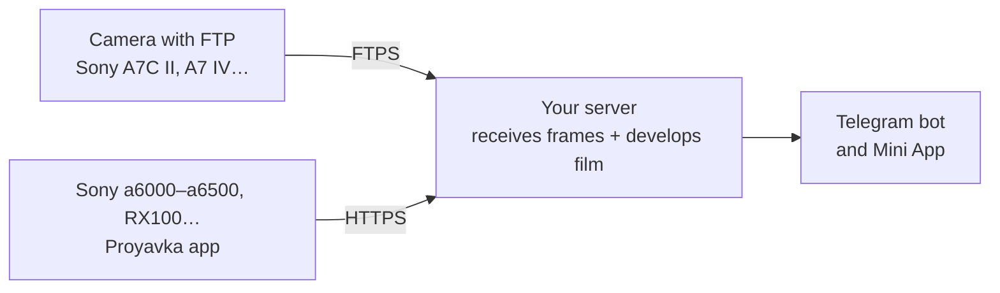

# Proyavka

**English** · [Русский](README.ru.md)

**Film development for your digital camera — right in Telegram.**
Take a shot, and half a minute later it arrives in a Telegram bot already "on film": colour, grain, halation, light leaks, a point-and-shoot date stamp. Change the film and effect strength with buttons under the photo or in the Mini App — a day-by-day feed with live previews of every film.

*Proyavka* (проявка) is Russian for "film development".

- 12 films, each with its own character, plus automatic choice by scene (night, sunset, overcast, landscape)
- 12 light leaks, date stamp, negative frame, strength from 25 to 150 %
- full-size export without Telegram compression
- frames arrive by themselves: over FTP from cameras that support it, or via the app for Sony PlayMemories cameras
- English and Russian interface
- runs on your own server — no subscriptions, no third-party cloud

## How it works



The camera needs an address on the internet to send frames to, so everything lives on a cheap VPS: it receives frames, develops them and sends them to Telegram. Nothing has to run at home.

<details>
<summary>Have a Raspberry Pi or a home server?</summary>

You can move processing home and keep the VPS as a mere mailbox — the smallest plan will do. Run the wizard on your home Linux machine and choose option 1: it sets up the VPS over SSH and a tunnel for the Mini App. No public IP at home is needed.
</details>

## Requirements

- **A VPS with Ubuntu 22.04+ or Debian 12+**: 1 CPU and 1–2 GB of RAM is enough. A clean one is best: the wizard installs nginx and vsftpd on it
- **Telegram** — create a bot in a minute with [@BotFather](https://t.me/BotFather)
- No domain needed: the wizard uses a free name like `1-2-3-4.sslip.io` with a Let's Encrypt certificate

## Install

SSH into your server and run:

```bash
git clone https://github.com/Melnikoff07/proyavka.git
cd proyavka
python3 setup.py
```

The wizard asks for a language and does the rest:

1. asks for the bot token and asks you to send `/start` to the bot — that's how it learns where to send frames;
2. gets an HTTPS certificate, sets up FTPS for cameras and the receiver for the camera app;
3. installs the bot as a service that starts on boot.

Then send **/camera** to your bot — it replies with the files for the memory card and a guide for your camera.

Running `python3 setup.py` again opens a menu: camera Wi-Fi, language, storage limits, update, bot status.

## Cameras

**With FTP upload** (Sony A7C II, A7 IV, A1, many Fujifilm, Canon, Nikon): the camera sends frames by itself. Import a certificate and enter the server address — [step by step](docs/ftp-cameras.md).

**Sony with PlayMemories apps** (a5000/a5100, a6000/a6300/a6500, a7 II/a7R II/a7S II, RX100 III–V, RX10 II/III and others [from the compatibility list](https://openmemories.readthedocs.io/devices.html)): install the Proyavka app with pmca-gui, put `config.txt` on the card, pick a Wi-Fi network once in the app — then **Proyavka → Send new** after shooting. [Step by step](docs/sony-app.md).

## Films

| Film | When | Character |
|---|---|---|
| Street Neg | street, city | hard teal shadows, warm highlights, muted colour |
| Muted Chrome | overcast, documentary | restrained colour, dense shadows, muted sky |
| Amber Neg | golden hour, sunset | amber highlights, soft shadows |
| Vivid 50 | landscape, nature | rich colour, deep sky, vivid greens |
| Cine 250D | cinema, mood | flat cine look, low colour, teal cast |
| Portrait 400 | people, portraits | warm skin, soft contrast, pastel |
| Golden 200 | sun, summer | warm, saturated, holiday feel |
| Super 400 | everyday, 2000s | greenish shadows, punchy point-and-shoot colour |
| Night 800T | night, lights | cold shadows, red glow around lights |
| Across 100 | b&w, soft | smooth b&w, fine grain |
| Grain X 400 | b&w, street, gritty | contrasty b&w with coarse grain |
| Expired | experiment | faded colour, shifted hues, lots of grain |

Every film is an original mathematical model (curves, shadow and highlight tints, saturation) turned into a 3D LUT on the fly. The names hint at genres and film character, not at specific products; the project is not affiliated with Kodak, Fujifilm, CineStill or Sony.

## Repository layout

| Folder | Contents |
|---|---|
| `setup.py` | setup and settings wizard |
| `bot/` | the bot and processing (`filmbot.py`), Mini App (`webapp.html`) |
| `relay/` | server setup: HTTPS, FTPS, camera upload receiver |
| `camera-app/` | app for Sony cameras (Android 4.1, no Gradle) |
| `docs/` | camera guides |

Secrets (`config.env`, `camera-config/`, the APK signing key) are created locally and never go into git — see `.gitignore`.

## Thanks

- [OpenMemories](https://github.com/ma1co/OpenMemories-Tweak) and [Sony-PMCA-RE](https://github.com/ma1co/Sony-PMCA-RE) — for making custom apps on Sony cameras possible
- [sslip.io](https://sslip.io) and [Let's Encrypt](https://letsencrypt.org) — for the free name and certificate

## License

[MIT](LICENSE)
