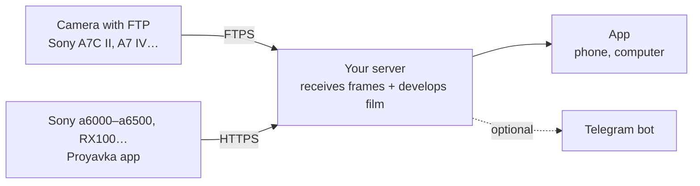

# Proyavka

**English** · [Русский](README.ru.md)

**Film development for your digital camera — on your phone, your computer, or in Telegram.**
Take a shot, and half a minute later it's in your feed already "on film": colour, grain, halation, light leaks, a point-and-shoot date stamp. Change the film and strength any time, with live previews of every film. Use it as an app (browser, iPhone, Android, Windows, Mac) — Telegram is optional.

*Proyavka* (проявка) is Russian for "film development".

- 12 films, each with its own character, plus automatic choice by scene (night, sunset, overcast, landscape)
- 12 light leaks, date stamp, negative frame, strength from 25 to 150 %
- your own LUTs: add a `.cube` file and it joins the film list; each user has their own, nobody else sees them
- frames arrive by themselves: over FTP from cameras that support it, or via the app for Sony PlayMemories cameras; phone photos via the "+" button
- RAW (ARW, CR3, NEF, RAF, DNG…) out of the box; with RAW+JPEG the JPEG is used
- crop (free, 1:1, 4:5, 3:2, 16:9) and batch edits: select a day's frames and change the film or leak, or delete them at once; deleted frames stay in the trash while there is space
- full-size files: download one or a ZIP on a computer, save straight to Photos on iPhone
- **no Telegram needed:** the app installs on a phone from the browser (iPhone: Share → Add to Home Screen; Android and computers: Install in Chrome or Edge); devices sign in with a one-time code or QR. Prefer Telegram? Connect a bot at setup or later in the settings — frames then also arrive in the chat with film buttons
- notifications when new frames are developed (switch them on or off per device), light / dark / auto theme
- share albums by link: pick a day or any frames, send the link — anyone can view and download them without signing in; delete the album and the link stops working
- your own films: build one from sliders with a live preview on your frame, share it as a text code, or take one from the community catalog (`community/looks.json` in this repo — suggest yours from the app, it opens a ready GitHub issue)
- one server for several people: family or friends by invite code, each with their own feed, camera and storage
- English and Russian interface, chosen per user
- runs on your own server — no subscriptions, no third-party cloud

> **Your server, your photos.** Proyavka is not a service you sign up for — you install your own copy on your own server in about 10 minutes: **[quick start ↓](#install)**. Nothing goes through the author: your photos, tokens and passwords stay on your machines.

## How it works



The camera needs an address on the internet to send frames to, so everything lives on a cheap VPS: it receives frames, develops them and shows them in the app (and in Telegram, if you connect it). Nothing has to run at home.

<details>
<summary>Have a Raspberry Pi or a home server?</summary>

You can move processing home and keep the VPS as a mere mailbox — the smallest plan will do. Run the wizard on your home Linux machine and choose option 1: it sets up the VPS over SSH and a tunnel for the app. No public IP at home is needed.
</details>

## Requirements

- **A VPS with Ubuntu 22.04+ or Debian 12+**: 1 CPU and 1–2 GB of RAM is enough. A clean one is best: the wizard installs nginx and vsftpd on it
- **Telegram is optional.** Proyavka works as an app in a browser and on a phone; connect a bot right away or later ([@BotFather](https://t.me/BotFather), a minute)
- No domain needed: the wizard uses a free name like `1-2-3-4.sslip.io` with a Let's Encrypt certificate

## Install

SSH into your server and run:

```bash
git clone https://github.com/Melnikoff07/proyavka.git
cd proyavka
python3 setup.py
```

The wizard asks for a language and does the rest:

1. asks how you'll use it: **the app** (no Telegram needed, you can connect it later in the settings) or **a Telegram bot** — then it asks for the bot token and `/start` in it;
2. gets an HTTPS certificate, sets up FTPS for cameras and the receiver for the camera app;
3. installs Proyavka as a service that starts on boot;
4. in app mode shows a **QR code** in the terminal: point your phone camera at it and you're in your Proyavka. On iPhone first use Share → Add to Home Screen and enter the code in the app. A computer and other phones: ⋯ → Link a device.

In the app, ⋯ opens the settings: storage and trash, film for new frames, language, devices, camera setup, Telegram, and for the admin also users and invites.

Next, the camera: ⋯ → Camera in the app (or **/camera** in the bot) — files for the memory card and a guide for your camera.

Running `python3 setup.py` again opens a menu: a QR code to sign in from a new device, camera Wi-Fi, language, storage and RAW, Telegram bot, update, status.

## Cameras

**With FTP upload** (Sony A7C II, A7 IV, A1, many Fujifilm, Canon, Nikon): the camera sends frames by itself. Import a certificate and enter the server address — [step by step](docs/ftp-cameras.md).

**Sony with PlayMemories apps** (a5000/a5100, a6000/a6300/a6500, a7 II/a7R II/a7S II, RX100 III–V, RX10 II/III and others [from the compatibility list](https://openmemories.readthedocs.io/devices.html)): install the Proyavka app with pmca-gui, put `config.txt` on the card, pick a Wi-Fi network once in the app — then **Proyavka → Send new** after shooting. [Step by step](docs/sony-app.md).

## Several people on one server

Whoever installed Proyavka is the admin. In the app, ⋯ → **Invite a person** gives a single-use code with a link and QR (valid for 7 days); the person enters it on the sign-in screen, types their name and lands in their own feed. With a bot connected, the same code works via Telegram (**/invite** in the bot). ⋯ → **Users** lists everyone with their storage limit (the admin's own too) and a remove button.

Each user has their own feed and frames, default film, language, storage limit (5 GB by default), devices, Telegram and camera — their own FTP login with a short password that's easy to type on a camera, and their own token for the Sony app (⋯ → Camera). Nobody sees anyone else's frames, and rendering takes turns between users so that one person's big batch doesn't hold up the others.

> **Honest note on privacy.** This is separation inside the app, not encryption. All photos are stored on the admin's server, and **technically the admin can open any file on it** — like the owner of any computer. Invite people who trust you, and join someone else's server only if you trust its owner.

## Films

| Film | When | Character |
|---|---|---|
| Street Neg | street, city | hard teal shadows, warm highlights, muted colour |
| Muted Chrome | overcast, documentary | restrained colour, dense shadows, muted sky |
| Amber Neg | golden hour, sunset | amber highlights, soft shadows |
| Vivid 50 | landscape, nature | rich colour, deep sky, vivid greens |
| Cine 250D | cinema, mood | flat cine look, low colour, teal cast |
| Portrait 400 | people, portraits | warm skin, soft contrast, pastel |
| Golden 200 | sun, summer | warm, saturated, holiday feel |
| Super 400 | everyday, 2000s | greenish shadows, punchy point-and-shoot colour |
| Night 800T | night, lights | cold shadows, red glow around lights |
| Across 100 | b&w, soft | smooth b&w, fine grain |
| Grain X 400 | b&w, street, gritty | contrasty b&w with coarse grain |
| Expired | experiment | faded colour, shifted hues, lots of grain |

Every film is an original mathematical model (curves, shadow and highlight tints, saturation) turned into a 3D LUT on the fly. The names hint at genres and film character, not at specific products; the project is not affiliated with Kodak, Fujifilm, CineStill or Sony.

## Customize

- **[Settings, files and logs](docs/configuration.md)** — what's in `config.env`, where frames and data live, how to read logs and restart the bot.
- **[Films: how they work and how to make your own](docs/films.md)** — every parameter explained; a new film is a dozen numbers.
- **Try films locally:** `.venv/bin/python bot/try_films.py photo.jpg` renders a sheet with every film — no server needed.

## Repository layout

| Folder | Contents |
|---|---|
| `setup.py` | setup and settings wizard |
| `bot/` | the server and processing (`filmbot.py`), the app (`webapp.html`), local film preview (`try_films.py`) |
| `relay/` | server setup: HTTPS, FTPS, camera upload receiver, cameras of invited users (`proyavka-user`) |
| `camera-app/` | app for Sony cameras (Android 4.1, no Gradle) |
| `docs/` | camera guides, settings, films |

Secrets (`config.env`, `camera-config/`, the APK signing key) are created locally and never go into git — see `.gitignore`.

## Thanks

- [OpenMemories](https://github.com/ma1co/OpenMemories-Tweak) and [Sony-PMCA-RE](https://github.com/ma1co/Sony-PMCA-RE) — for making custom apps on Sony cameras possible
- [sslip.io](https://sslip.io) and [Let's Encrypt](https://letsencrypt.org) — for the free name and certificate

## License

[MIT](LICENSE)
