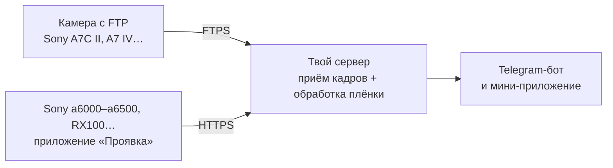

# Проявка

[English](README.md) · **Русский**

**Плёночная проявка для цифровой камеры — прямо в Telegram.**
Снимаешь на камеру, через полминуты кадр приходит в Telegram-бота уже «на плёнку»: цвет, зерно, халяция, засветы, дата как у мыльницы. Плёнку и силу эффекта можно поменять кнопками под фото или в мини-приложении — лента кадров по дням с живыми превью всех плёнок.

- 12 плёнок, каждая со своим характером, плюс автовыбор по сюжету (ночь, закат, пасмурно, пейзаж)
- 12 засветов, дата, рамка негатива, сила эффекта от 25 до 150 %
- экспорт в полный размер без сжатия Telegram
- кадры приходят сами: по FTP с камер, которые это умеют, или через приложение для Sony с PlayMemories; фото с телефона — кнопкой «+» в мини-приложении
- кадрирование (свободно, 1:1, 4:5, 3:2, 16:9) и правка пачкой: выбрал кадры дня — сменил плёнку, засвет или удалил разом; удалённое лежит в корзине (`/trash`), пока хватает места
- один бот на несколько человек: семья или друзья по ссылкам-приглашениям, у каждого своя лента, своя камера и своё место
- интерфейс на русском и английском, у каждого пользователя свой
- всё работает на своём сервере, никаких подписок и чужих облаков

> **Твой бот, твой сервер.** «Проявка» — не сервис, где надо регистрироваться: ты ставишь свою копию на свой сервер минут за 10 — **[быстрый старт ↓](#установка)**. Через автора ничего не проходит: фото, токен бота и пароли остаются на твоих машинах.

## Как это устроено



Камере нужен адрес в интернете, куда слать кадры, поэтому всё живёт на недорогом VPS: он принимает кадры, проявляет их и отправляет в Telegram. Дома ничего держать не нужно.

<details>
<summary>Есть Raspberry Pi или домашний сервер?</summary>

Обработку можно перенести домой, а VPS оставить только «почтовым ящиком» — подойдёт самый слабый тариф. Запусти мастер на домашнем Linux-компьютере и выбери вариант 1: он сам настроит VPS по SSH и туннель для мини-приложения. Белый IP дома не нужен.
</details>

## Что понадобится

- **VPS с Ubuntu 22.04+ или Debian 12+**: 1 ядро и 1–2 ГБ памяти хватит. Лучше чистый: мастер ставит на него nginx и vsftpd
- **Telegram** — бот создаётся за минуту у [@BotFather](https://t.me/BotFather)
- Покупать домен не нужно: мастер использует бесплатное имя вида `1-2-3-4.sslip.io` с сертификатом Let's Encrypt

## Установка

Зайди на сервер по SSH и выполни:

```bash
git clone https://github.com/Melnikoff07/proyavka.git
cd proyavka
python3 setup.py
```

Мастер спросит язык и дальше всё сделает сам:

1. попросит токен бота и попросит написать боту `/start` — так он узнает, куда слать кадры;
2. получит сертификат HTTPS, настроит FTPS для камер и приёмник для приложения;
3. поставит бота на автозапуск.

Потом отправь боту **/camera** — он пришлёт файлы для карты памяти и инструкцию для твоей камеры.

Повторный запуск `python3 setup.py` открывает меню: Wi-Fi камеры, язык, лимиты места, обновление, состояние бота.

## Камеры

**С отправкой по FTP** (Sony A7C II, A7 IV, A1, многие Fujifilm, Canon, Nikon): камера отправляет кадры сама. Нужно импортировать сертификат и ввести адрес сервера — [пошагово](docs/ftp-cameras.ru.md).

**Sony с приложениями PlayMemories** (a5000/a5100, a6000/a6300/a6500, a7 II/a7R II/a7S II, RX100 III–V, RX10 II/III и другие [из списка совместимых](https://openmemories.readthedocs.io/devices.html)): ставишь приложение «Проявка» через pmca-gui, кладёшь `config.txt` на карту, в приложении один раз выбираешь Wi-Fi — дальше **Проявка → Отправить новые** после съёмки. [Пошагово](docs/sony-app.ru.md).

## Несколько человек в одном боте

Тот, кто ставил бота, — администратор. Команда **/invite** даёт одноразовую ссылку-приглашение (живёт 7 дней), **/users** — список пользователей: лимит места и удаление.

У каждого пользователя своё: лента и кадры, кнопки под фото, мини-приложение, экспорт, плёнка по умолчанию, язык, лимит места (по умолчанию 5 ГБ) и камера — свой FTP-логин и свой токен приложения на Sony, их присылает **/camera**. Бот не покажет чужие кадры ни в чате, ни в мини-приложении, а обработка идёт по очереди между пользователями, чтобы большая пачка одного не задерживала остальных.

> **Честно о приватности.** Это разделение внутри бота, а не шифрование. Все фото лежат на сервере администратора, и **технически он может открыть любые файлы** — как владелец любого компьютера. Зови в свой бот тех, кто тебе доверяет, и иди в чужой, только если доверяешь его владельцу.

## Плёнки

| Плёнка | Когда | Характер |
|---|---|---|
| Street Neg | улица, город | жёсткие тени с бирюзой, тёплые света, приглушённый цвет |
| Muted Chrome | пасмурно, документалка | сдержанный цвет, плотные тени, приглушённое небо |
| Amber Neg | золотой час, закат | янтарные света, мягкие тени |
| Vivid 50 | пейзаж, природа | сочный цвет, глубокое небо, яркая зелень |
| Cine 250D | кино, настроение | плоский кинолук, мало цвета, бирюзовый оттенок |
| Portrait 400 | люди, портреты | тёплая кожа, мягкий контраст, пастель |
| Golden 200 | солнце, лето | тёплый, насыщенный, отпускной |
| Super 400 | повседневка, нулевые | зеленоватые тени, бодрый цвет мыльницы |
| Night 800T | ночь, огни | холодные тени, красное свечение вокруг огней |
| Across 100 | ч/б, мягко | гладкая ч/б, тонкое зерно |
| Grain X 400 | ч/б, улица, жёстко | контрастная ч/б с крупным зерном |
| Expired | эксперимент | выцветший цвет, сдвиг оттенков, много зерна |

Все плёнки — собственные математические модели (кривые, оттенки теней и светов, насыщенность), из которых на лету строится 3D-LUT. Названия — отсылки к жанрам и характеру плёнок, а не копии конкретных продуктов; проект не связан с Kodak, Fujifilm, CineStill и Sony.

## Настройка и доработка

- **[Настройки, файлы и логи](docs/configuration.ru.md)** — что в `config.env`, где лежат кадры и данные, как смотреть логи и перезапускать бота.
- **[Плёнки: как устроены и как сделать свою](docs/films.ru.md)** — каждый параметр с объяснением; новая плёнка — это десяток чисел.
- **Попробовать плёнки у себя:** `.venv/bin/python bot/try_films.py photo.jpg` — лист со всеми плёнками, без Telegram.

## Устройство репозитория

| Папка | Что внутри |
|---|---|
| `setup.py` | мастер установки и настройки |
| `bot/` | бот и обработка (`filmbot.py`), мини-приложение (`webapp.html`), проба плёнок (`try_films.py`) |
| `relay/` | настройка сервера: HTTPS, FTPS, приёмник кадров с камеры, камеры приглашённых пользователей (`proyavka-user`) |
| `camera-app/` | приложение для Sony (Android 4.1, без Gradle) |
| `docs/` | инструкции для камер, настройки, плёнки |

Секреты (`config.env`, `camera-config/`, ключ подписи APK) создаются у тебя локально и в git не попадают — см. `.gitignore`.

## Благодарности

- [OpenMemories](https://github.com/ma1co/OpenMemories-Tweak) и [Sony-PMCA-RE](https://github.com/ma1co/Sony-PMCA-RE) — за возможность ставить свои приложения на камеры Sony
- [sslip.io](https://sslip.io) и [Let's Encrypt](https://letsencrypt.org) — за бесплатные имя и сертификат

## Лицензия

[MIT](LICENSE)
