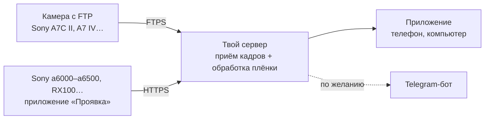

# Проявка

[English](README.md) · **Русский**

**Плёночная проявка для цифровой камеры — на телефоне, на компьютере или в Telegram.**
Снимаешь на камеру, через полминуты кадр уже в ленте «на плёнку»: цвет, зерно, халяция, засветы, дата как у мыльницы. Плёнку и силу эффекта можно поменять в любой момент, с живыми превью всех плёнок. Работает как приложение (браузер, iPhone, Android, Windows, Mac) — Telegram по желанию.

- 12 плёнок, каждая со своим характером, плюс автовыбор по сюжету (ночь, закат, пасмурно, пейзаж)
- 12 засветов, дата, рамка негатива, сила эффекта от 25 до 150 %
- свои LUT: добавь файл `.cube` — он встанет в список плёнок; у каждого пользователя свои, чужие не видны
- кадры приходят сами: по FTP с камер, которые это умеют, или через приложение для Sony с PlayMemories; фото с телефона — кнопкой «+»
- RAW (ARW, CR3, NEF, RAF, DNG…) сразу; если камера шлёт RAW+JPEG, берётся JPEG
- кадрирование (свободно, 1:1, 4:5, 3:2, 16:9) и правка пачкой: выбрал кадры дня — сменил плёнку, засвет или удалил разом; удалённое лежит в корзине, пока хватает места
- файлы в полном размере: на компьютере — скачать один или ZIP-архивом, на iPhone — сразу в «Фото»
- **Telegram не нужен:** приложение ставится на телефон из браузера (iPhone: «Поделиться» → «На экран „Домой“»; Android и компьютер — «Установить» в Chrome или Edge); устройства входят по одноразовому коду или QR. Любишь Telegram? Подключи бота при установке или потом в настройках — кадры будут приходить и в чат, с кнопками плёнок
- уведомления о проявленных кадрах (включаются и выключаются на каждом устройстве), тема: светлая, тёмная или как в системе
- альбомы по ссылке: выбери день или любые кадры, отправь ссылку — по ней смотрят и скачивают без входа; удалил альбом — ссылка перестала работать
- свои плёнки: собери ползунками с живым просмотром на своём кадре, поделись текстовым кодом или возьми из каталога сообщества (`community/looks.json` в этом репозитории — свою можно предложить из приложения, откроется готовая заявка на GitHub)
- один сервер на несколько человек: семья или друзья по коду-приглашению, у каждого своя лента, своя камера и своё место
- интерфейс на русском и английском, у каждого пользователя свой
- всё работает на своём сервере, никаких подписок и чужих облаков

> **Твой сервер, твои фото.** «Проявка» — не сервис, где надо регистрироваться: ты ставишь свою копию на свой сервер минут за 10 — **[быстрый старт ↓](#установка)**. Через автора ничего не проходит: фото, токены и пароли остаются на твоих машинах.

## Как это устроено



Камере нужен адрес в интернете, куда слать кадры, поэтому всё живёт на недорогом VPS: он принимает кадры, проявляет их и показывает в приложении (и в Telegram, если подключить). Дома ничего держать не нужно.

<details>
<summary>Есть Raspberry Pi или домашний сервер?</summary>

Обработку можно перенести домой, а VPS оставить только «почтовым ящиком» — подойдёт самый слабый тариф. Запусти мастер на домашнем Linux-компьютере и выбери вариант 1: он сам настроит VPS по SSH и туннель для приложения. Белый IP дома не нужен.
</details>

## Что понадобится

- **VPS с Ubuntu 22.04+ или Debian 12+**: 1 ядро и 1–2 ГБ памяти хватит. Лучше чистый: мастер ставит на него nginx и vsftpd
- **Telegram — по желанию.** «Проявка» работает и как приложение в браузере и на телефоне; бота можно подключить сразу или потом ([@BotFather](https://t.me/BotFather), минута)
- Покупать домен не нужно: мастер использует бесплатное имя вида `1-2-3-4.sslip.io` с сертификатом Let's Encrypt

## Установка

Зайди на сервер по SSH и выполни:

```bash
git clone https://github.com/Melnikoff07/proyavka.git
cd proyavka
python3 setup.py
```

Мастер спросит язык и дальше всё сделает сам:

1. спросит, как пользоваться: **приложением** (Telegram не нужен, его можно подключить потом в настройках) или **Telegram-ботом** — тогда попросит токен бота и `/start` в нём;
2. получит сертификат HTTPS, настроит FTPS для камер и приёмник для приложения;
3. поставит «Проявку» на автозапуск;
4. в режиме приложения покажет в терминале **QR-код**: наведи камеру телефона — и ты в своей «Проявке». На iPhone сначала «Поделиться» → «На экран „Домой“», код вводится уже в приложении. Компьютер и другие телефоны — «⋯» → «Привязать устройство».

В приложении «⋯» — настройки: место и корзина, плёнка для новых кадров, язык, устройства, настройка камеры, Telegram, а у администратора ещё пользователи и приглашения.

Дальше камера: «⋯» → «Камера» в приложении (или **/camera** в боте) — файлы для карты памяти и инструкция для твоей камеры.

Повторный запуск `python3 setup.py` открывает меню: QR-код для входа с нового устройства, Wi-Fi камеры, язык, место и RAW, Telegram-бот, обновление, состояние.

## Камеры

**С отправкой по FTP** (Sony A7C II, A7 IV, A1, многие Fujifilm, Canon, Nikon): камера отправляет кадры сама. Нужно импортировать сертификат и ввести адрес сервера — [пошагово](docs/ftp-cameras.ru.md).

**Sony с приложениями PlayMemories** (a5000/a5100, a6000/a6300/a6500, a7 II/a7R II/a7S II, RX100 III–V, RX10 II/III и другие [из списка совместимых](https://openmemories.readthedocs.io/devices.html)): ставишь приложение «Проявка» через pmca-gui, кладёшь `config.txt` на карту, в приложении один раз выбираешь Wi-Fi — дальше **Проявка → Отправить новые** после съёмки. [Пошагово](docs/sony-app.ru.md).

## Несколько человек на одном сервере

Тот, кто ставил «Проявку», — администратор. В приложении «⋯» → **«Пригласить человека»** даёт одноразовый код со ссылкой и QR (живёт 7 дней): человек вводит его на экране входа, пишет имя — и попадает в свою ленту. Если бот подключён, тот же код работает и через Telegram (**/invite** в боте). «⋯» → **«Пользователи»** — список с лимитом места (в том числе своим) и удалением.

У каждого пользователя своё: лента и кадры, плёнка по умолчанию, язык, лимит места (по умолчанию 5 ГБ), устройства, Telegram и камера — свой FTP-логин с коротким паролем, который легко ввести на камере, и свой токен приложения на Sony («⋯» → «Камера»). Чужие кадры никому не видны, а обработка идёт по очереди между пользователями, чтобы большая пачка одного не задерживала остальных.

> **Честно о приватности.** Это разделение внутри приложения, а не шифрование. Все фото лежат на сервере администратора, и **технически он может открыть любые файлы** — как владелец любого компьютера. Зови к себе тех, кто тебе доверяет, и иди на чужой сервер, только если доверяешь его владельцу.

## Плёнки

| Плёнка | Когда | Характер |
|---|---|---|
| Street Neg | улица, город | бирюзовые тени, тёплые света, плотный цвет |
| Muted Chrome | пасмурно, документалка | сдержанный цвет, глубокие тени, оливковая зелень, бирюзовое небо |
| Amber Neg | золотой час, закат | янтарные света, мягкий контраст, тёплые тени |
| Vivid 50 | пейзаж, природа | слайдовая плотность: глубокие чёрные, сочная зелень и небо без фиолетового |
| Cine 250D | кино, настроение | кинонегатив на кинопечати: бирюзовые тени, тёплая кожа, мягкие света |
| Portrait 400 | люди, портреты | тёплая кожа, мягкий контраст, пастель |
| Golden 200 | солнце, лето | тёплый жёлтый, сочные красные и жёлтые |
| Super 400 | повседневка, нулевые | зеленоватые тени, бодрый цвет мыльницы |
| Night 800T | ночь, огни | холодные тени, красно-оранжевые ореолы только вокруг огней |
| Across 100 | ч/б, мягко | гладкая ч/б, тонкое зерно, длинные полутона, красное темнее |
| Grain X 400 | ч/б, улица, жёстко | контрастная ч/б с крупным зерном и глубокими чёрными |
| Expired | эксперимент | выцветший цвет, зеленоватые тени, тёплые света, много зерна |
| Pastel 160 | свет, люди, лето | светлая и воздушная: пастельные цвета, мягкий контраст, нежная кожа |
| Mint 400H | свадьба, пастель, прохлада | прохладная пастель: мятная зелень, светлая кожа, чистое небо |
| Punch 100 | путешествия, яркий день | сочный негатив: насыщенные красные и синее небо, мелкое зерно |
| Chrome 100 | пейзаж, архитектура | чистый слайд: нейтральные белые, глубокие тени, точный цвет |
| Classic 64 | улица, ретро, солнце | тёплые красные и жёлтые, плотные тени, мягкая зелень |
| Cine 50D | день, кино | чистая дневная киноплёнка: мягкие света, тонкое зерно, лёгкий ореол |
| Hard Neg | улица, повседневка | жёсткий контраст, бирюзово-зелёные тени, приглушённая зелень |
| Bleach Bypass | драма, кино | высокий контраст и мало цвета |
| Cross Process | эксперимент, лето | кросс-процесс: жёлто-зелёные света, синие тени, яркий цвет |
| Instant | вечеринка, ностальгия | моментальная фотография: молочные тени, тёплые света, мягкий фокус |
| Red Filter | ч/б, небо, драма | ч/б через красный фильтр: тёмное небо, светлая кожа, объёмные облака |
| Sepia | ч/б, тёплый тон | тонированная ч/б: тёплые тени и света, мягкое зерно |
| Push 3200 | ч/б, ночь, зерно | ч/б с пушем: крупное зерно, мягкий контраст |

Все плёнки — собственные математические модели (кривые, оттенки теней и светов, насыщенность), из которых на лету строится 3D-LUT. Названия — отсылки к жанрам и характеру плёнок, а не копии конкретных продуктов; проект не связан с Kodak, Fujifilm, CineStill и Sony.

## Настройка и доработка

- **[Настройки, файлы и логи](docs/configuration.ru.md)** — что в `config.env`, где лежат кадры и данные, как смотреть логи и перезапускать бота.
- **[Плёнки: как устроены и как сделать свою](docs/films.ru.md)** — каждый параметр с объяснением; новая плёнка — это десяток чисел.
- **[Как устроен код](docs/architecture.ru.md)** — модули, их слои и правила для импортов и тестов.
- **[Что изменилось](CHANGELOG.md#журнал-изменений)** — все версии, новые сверху.
- **Тесты:** `pip install -r tests/requirements.txt && python tests/run_all.py` — бот целиком с подменённым Telegram и синтетическими кадрами, без сети и камеры (то же самое идёт в GitHub Actions при каждом push).
- **Попробовать плёнки у себя:** `.venv/bin/python bot/try_films.py photo.jpg` — лист со всеми плёнками, без сервера.

## Устройство репозитория

| Папка | Что внутри |
|---|---|
| `setup.py` | мастер установки и настройки |
| `bot/` | точка входа (`filmbot.py`), приложение (`webapp.html`), проба плёнок (`try_films.py`) |
| `bot/proyavka/` | код, по модулю на дело: плёнки и цвет (`film.py`), обработка кадра (`imaging.py`), планировщик, Telegram, веб-сервер… — см. [как устроен код](docs/architecture.ru.md) |
| `relay/` | настройка сервера: HTTPS, FTPS, приёмник кадров с камеры, камеры приглашённых пользователей (`proyavka-user`) |
| `community/` | каталог плёнок, которыми поделились люди (`looks.json`), и скрипт для добавления |
| `tests/` | наборы тестов и стенд, запускающий бота целиком без Telegram |
| `camera-app/` | приложение для Sony (Android 4.1, без Gradle) |
| `docs/` | инструкции для камер, настройки, плёнки |

Секреты (`config.env`, `camera-config/`, ключ подписи APK) создаются у тебя локально и в git не попадают — см. `.gitignore`.

## Благодарности

- [OpenMemories](https://github.com/ma1co/OpenMemories-Tweak) и [Sony-PMCA-RE](https://github.com/ma1co/Sony-PMCA-RE) — за возможность ставить свои приложения на камеры Sony
- [sslip.io](https://sslip.io) и [Let's Encrypt](https://letsencrypt.org) — за бесплатные имя и сертификат

## Лицензия

[MIT](LICENSE)
